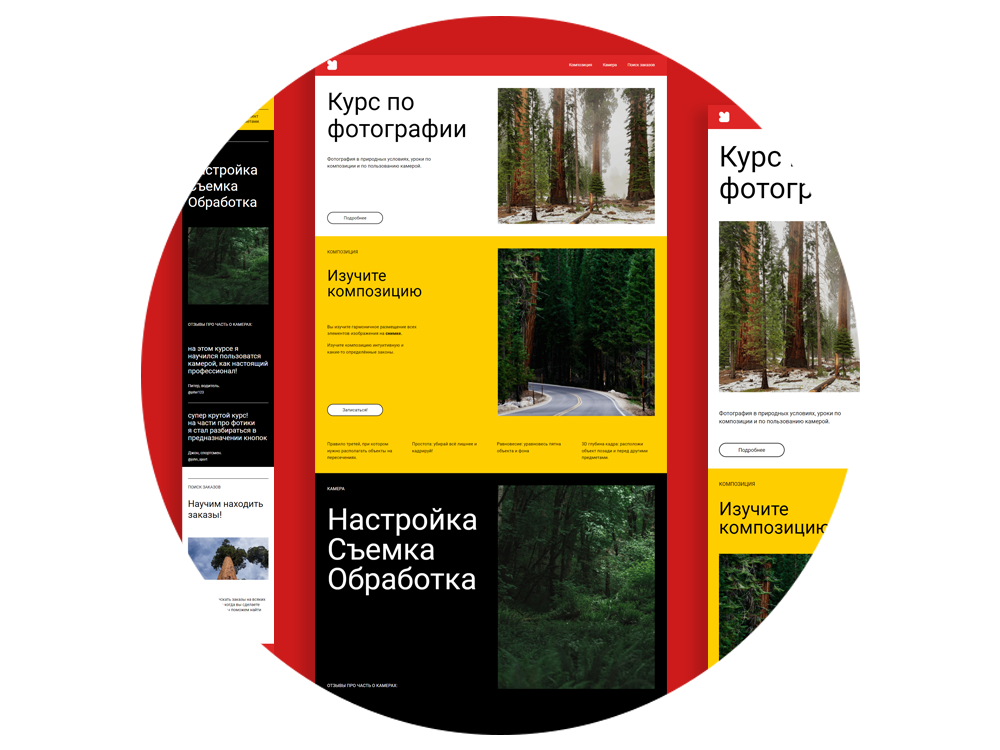

#  Проект «Курс по фотографии»
**[Ссылка на проект](https://geniav.github.io/photo-lessons/index.html)**

**ЦЕЛЬ ПРОЕКТА**

Освоение препроцессора [**SASS**](https://sass-lang.com/).

**STACK**

HTML, CSS, JavaScript, SASS.

**ОПИСАНИЕ**

**Учебный проект** представляет собой лэндинг для курса по фотографии.

Стили в проекте написаны на препроцессоре SASS, базовая функциональность — на JavaScript _(работа бургерного меню, форма для отправки электронного адреса в футере, изменение текста на кнопке в футере, наведение на кнопку)._

Верстка адаптирована под устройства с шириной экрана **1440px**, **768px** и **320px**.

**ЗАПУСК ПРОЕКТА**

   | Вариант | Описание |
| ------ | ------ |
| 1 | запуск из папки проекта _(файл index.html)_ |
| 2 | запуск в VSCode при помощи расширения [LiveServer](https://marketplace.visualstudio.com/items?itemName=ritwickdey.LiveServer) |

